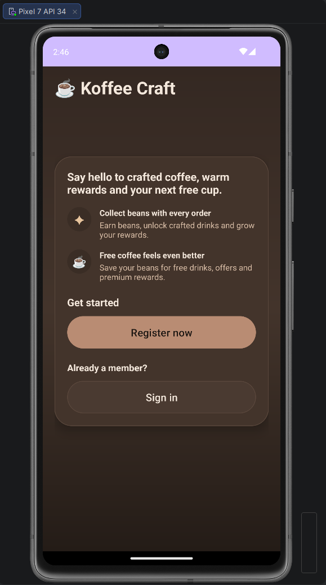
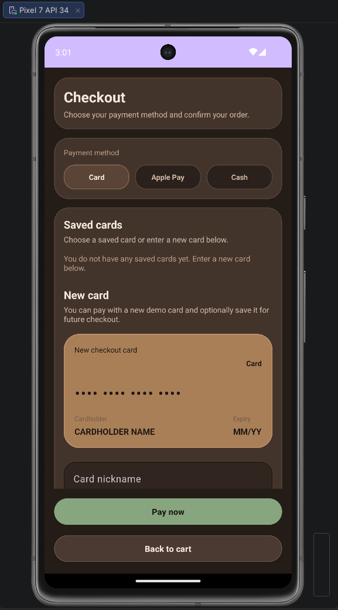

# KoffeeCraft

KoffeeCraft is a premium Android coffee shop application built to deliver a polished customer ordering experience together with a practical admin management system.

The project combines modern mobile UI, structured Android development, Room database persistence, product customisation, order handling, saved payment methods, feedback collection, notifications, favourites, reusable presets, and admin-side catalogue management.

## Overview

KoffeeCraft was designed as a complete mobile application rather than a simple prototype.  
It includes both **customer-facing journeys** and **admin-facing tools**, supported by a consistent premium coffee-inspired interface and a structured Kotlin-based architecture.

The application focuses on:
- strong visual consistency
- practical mobile user flows
- persistent local data with Room
- feature-rich customer and admin experiences
- real testing and supporting technical documentation

## Customer Features

Customers can:

- create an account and sign in
- browse coffee, cake, and merchandise products
- explore featured, recommended, and newly added items
- customise selected products with sizes, extras, and allergen-aware options
- add products to the cart and place orders
- choose a payment method during checkout
- save payment cards for future purchases
- track order progress
- receive notifications and inbox messages
- save favourites and reusable presets
- leave ratings and written feedback after orders
- interact with rewards-related functionality

## Admin Features

Admins can:

- sign in through a dedicated admin flow
- access an admin dashboard with operational summary cards
- manage products across the menu catalogue
- add, edit, enable, disable, and delete products
- manage product sizes, extras, and allergens
- monitor customer order activity
- update order progress through preparation stages
- review customer feedback and ratings
- manage admin-side settings and internal access tools
- work with internal communication and notification-related features

## Screenshots

### Welcome Screen

### Customer Home

### Admin Dashboard

### Admin Settings

### Checkout

## Tech Stack

- **Language:** Kotlin
- **Platform:** Android
- **UI:** XML layouts, Material Components
- **Architecture:** layered Android structure with presentation, persistence, and supporting logic
- **Navigation:** Navigation Component
- **Database:** Room / SQLite
- **Testing:** unit tests, instrumented DAO tests, repository tests, and UI smoke tests
- **Build System:** Gradle

## Architecture Overview

The application follows a structured Android project layout with separation between UI, data persistence, and feature logic.

Main areas of the project include:

- customer and admin UI flows
- Room entities, DAOs, and database migrations
- repositories supporting data access and feature behaviour
- order, payment, feedback, notification, favourites, and preset-related functionality
- supporting documentation and testing evidence

## Database

KoffeeCraft uses a Room SQLite database to manage:

- customers and admins
- products and product configuration
- orders and order items
- payments and saved payment cards
- feedback and ratings
- notifications and inbox messages
- favourites and reusable presets

## Testing

The project includes multiple levels of testing:

- local unit tests
- instrumented repository tests
- instrumented DAO tests
- UI smoke tests

## Project Structure

- `app/src/main` — main application source code and resources
- `app/src/test` — local unit tests
- `app/src/androidTest` — instrumented and UI tests
- `app/schemas` — Room schema exports
- `docs` — architecture notes, troubleshooting notes, testing evidence, and screenshots

## How to Run

1. Open the project in Android Studio.
2. Allow Gradle sync to finish.
3. Run the application on an emulator or Android device.
4. Explore both the customer and admin flows.

## Documentation

Additional project documentation includes:

- `architecture.md`
- `dev-notes-troubleshooting.md`
- `testing-evidence.md`

## Author

**Andrzej Dul**  
Software Engineering.